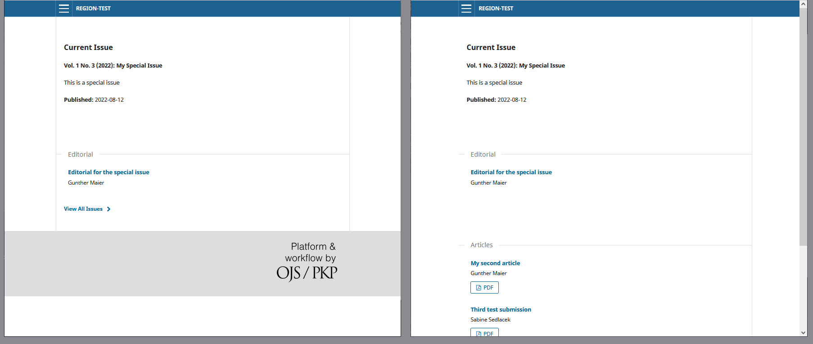

# specialIssueTOC
A plugin for OJS (Open Journals System) that allows one to add articles published in another issue to the TOC of an issue

## Why this plugin?
I created this plugin because in our journal REGION (https://region.ersa.org) we publish aricles as soon as hey are ready. When the article is for a special issue, i will first be published in a regular issue and then repackaged into the special issue when all its articles are ready. This implies that on the page of the special issue in OJS the articles (already published) do **not** show up. This plugin is supposed to resolve that issue.

## How this plugin works
When acive, the plugin is triggered on every issue and article page. Since in our case, only special issues have a description, the plugin checks for that and exits when no description exists (this should be adjusted later).

Then, the plugin gets volume and number for the currenly displayed issue. From that information, it creates a search string of the form "v[x]i[y]n", where [x] is the volume number and [y] is the number number. For example, for Volume 9 Number 3, the search string will be "v9i3n".

To link aricles already published to the special issue Volume 9 Number 3, you have to add a subject code to each of these articles. You may have to activate Subject in OJS (Workflow - Submission - Metadata). The subject entries have the above mentioned form plus a sumber, which determines the ordering of the aricles. The subject "v9i3n01" will mark the first, "v9i3n02" the second article in the table of contents. Of course, you can drop the leading zero when you have less than 10 articles to display.

The plugin searches for those subject entries, gets the corresponding metadata (title, authors, link), and places them after any already existing entries. This last step is done via a Javascript event listener.

The left part of the following picture shows the issue page without the plugin, the right part witth the plugin. Note the aricles-section and the two articles in the right part. 

## How to use this plugin

To use the plugin, take the following steps:
1. download the file specialIssueTOC.tar.gz and upload it as a new plugin to your OJS (you need to have administrator rights to do that). The plugin will show up among the Generic Plugins. 
2. Activate the plugin. 
3. Find volume and number for the issue where you want the articles to show up. Make sure, this issue has a description.
4. Add subjects with the required format.

## How to improve this plugin

So far, the plugin was only tested on my test installation of OJS (Version 3.3.0.11), not on a management version. This test will be done very soon.

The plugin probably shows my limited knowledge of PHP and of the structure of OJS. Probably, the database search can be streamlines and improved. The current version is the result of myself searching around in the database to find a connection between a subject entry and a submissionID. I then hardcoded this query into the plugin. This should be reviewed and probably improved. 

Also, the plugin assumes that it should process only issues witth a description. This should be generalized and the user should be given the opportunity to change this.
